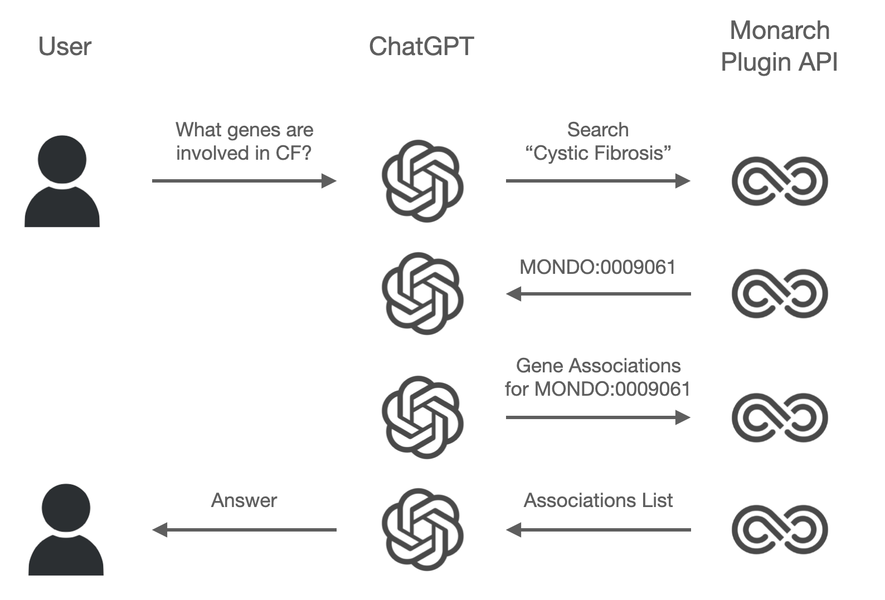

```{r setup, include=FALSE}
knitr::opts_chunk$set(echo = TRUE, warning = FALSE, message = FALSE)
source("load.R")
```

Source repo for this document: [https://github.com/monarch-initiative/oai-plugin-evals/](https://github.com/monarch-initiative/oai-plugin-evals/)

## Background

This report shows preliminary evaluations for a snapshot of the [Monarch Assistant](https://monarch-assistant.streamlit.app/)), a self-deployed version of the [Monarch ChatGPT Plugin](https://monarchinit.medium.com/knowledge-backed-ai-with-monarch-a-match-made-in-heaven-a8296eec6b9f), on portions of the [GeneTuring](https://www.biorxiv.org/content/10.1101/2023.03.11.532238v1.abstract) evaluation benchmark.

Both versions are based on the same technology:  [function-calling](https://openai.com/blog/function-calling-and-other-api-updates) features available in OpenAI `gpt-3.5-turbo-0604` and `gpt-4-0604` models. During a chat the list of available functions is provided to the model. Model function call messages are translated to requests to a [simplified Monarch API](https://oai-monarch-plugin.monarchinitiative.org/openapi.json) ([github](https://github.com/monarch-initiative/oai-monarch-plugin)), which provides low-token access in front of the general [Monarch API](https://api-v3.monarchinitiative.org/v3/docs). API responses are fed back to the model, at which point it may summarize the information for the user, or decide to make a followup call if appropriate.



The API wrapper currently supports a limited subset of Monarch functionality:

- Search
- Disease <-> Gene association lookup
- Gene <-> Phenotype association lookup
- Phenotype <-> Disease association lookup

<br />

#### GeneTuring Benchmark

[GeneTuring](https://www.biorxiv.org/content/10.1101/2023.03.11.532238v1.abstract) is a benchmark dataset for genetic/genomic question and answer tasks.^[The [Cancer Genetics BioNLP](https://huggingface.co/datasets/bigbio/bionlp_st_2013_cg/viewer/bionlp_st_2013_cg_source) benchmark is the only other I know of, focusing on entity extraction but also providing some association and equivalence information.] The benchmark consists of 50 questions in each of 12 modules. Some examples:

- "Module": Gene alias", "Question": "What is the official gene symbol of LMP10?", "Goldstandard": "PSMB10"
- "Module": "Gene disease association", "Question": "What are genes related to Distal renal tubular acidosis?", "Goldstandard": "SLC4A1, ATP6V0A4"
- "Module": "Gene location", "Question": "Which chromosome is RP11-17A4.3 gene located on human genome?", "Goldstandard": "chr8"
- "Module": "Gene ontology", "Question": "What is the enriched gene ontology term associated with FMR1, FBXL2, TMEM41B, PHB1, DDX56?", "Goldstandard": "modulation by host of viral rna genome replication"
- "Module": "Human genome DNA aligment", "Question": "Align the DNA sequence to the human genome:TGAGAGCACAGTGGTGA[truncaded]", "Goldstandard": "chr1:234883857-234883957"
- "Module": "Multi-species DNA aligment", "Question": "Which organism does the DNA sequence come from:TTCAATTCTCTGTAGGCAAGGA[truncated]", "Goldstandard": "rat"
- "Module": "Gene name conversion", "Question": "Convert ENSG00000205403 to official gene symbol.", "Goldstandard": "CFI"
- "Module": "Gene name extraction", "Question": "What are the gene and protein names in the sentence: The H5 mutants were: DH5 (all amino acids in D configuration) and H5F (where all His are replaced by Phe at positions 3, 7, 8, 15, 18, 19, 21).?", "Goldstandard": "H5 mutants, DH5, H5F" (Note: gold standard may be "No gene")
- "Module": "Protein-coding genes", "Question": "Is NODAL a protein-coding gene?", "Goldstandard": "TRUE" (Note: gold standard may be null to indicate false)
- "Module": "Gene SNP association", "Question": "Which gene is SNP rs1217074595 associated with?", "Goldstandard": "LINC01270"
- "Module": "SNP location", "Question": "Which chromosome does SNP rs545148486 locate on human genome?", "Goldstandard": "chr16"
- "Module": "TF regulation", "Question": "Does transcription factor ETV4 activate or repress gene ERBB2?", "Goldstandard": "Repression"


## Methods

We evaluate two modules fit for the Monarch Assistant: "Gene alias" and "Gene disease association". Questions and answer scoring for these modules are generated by the GeneTuring authors as follows. *Note the use of OMIM for gene-disease association data, which is also a Monarch data source.*

**Gene alias**: "The information of official gene names and their aliases for human protein-coding genes was downloaded from NCBI website13. 50 genes with at least one alias were randomly selected. For each gene, one alias was randomly selected to produce the question." For scoring, the authors suggest a Jaccard index, comparing the set of names mentioned in an answer to the (single) official gene name.

**Gene disease association**: "Gene-disease association information was downloaded from OMIM website. 50 diseases were randomly selected and all genes associated with each disease were recorded." Scoring uses a basic accuracy score, computing the percentage of gold-standard genes mentioned in an answer.

Models evaluated:

- **3.5 Base**: GPT-3.5 based model with no access to Monarch APIs for comparison purposes.
- **4 Base**: GPT-4 based model with no access to Monarch APIs for comparison purposes.
- **3.5 + Monarch**: GPT-3.5 based Monarch Assistant with access to the Monarch wrapper API.
- **4 + Monarch**: GPT-4 based Monarch Assistant with access to the Monarch wrapper API. This model should be most similar to that provided by the ChatGPT plugin, though minor differences may occur do to function-calling implementation details or model differences used by plugins.


Response scoring is handled by Evaluator Agents, provided with callable functions to extract mentioned gene names and compute the relevant scoring statistics ([GitHub](https://github.com/monarch-initiative/oai-plugin-evals/blob/main/src/oai_plugin_evals/agents.py)). This strategy seems to work well, though there's a growing literature on proper model-based evaluation and we will need to perform some human evaluation for validation.


## Results

Most scores were either `1.0` (perfect according to each tasks' respective scoring criteria) or `0.0`, but in a few cases were in between. This plot buckets scores into several categories, broken out by agent type and question module.

```{r echo=FALSE, warning=FALSE}
library(tidyr)
library(dplyr)
library(ggplot2)

data2 <- data %>%
	mutate(agent_name = factor(agent_name, 
														 levels = c("Dummy Agent GPT35", "Dummy Agent GPT4", "Dummy Agent GPT4 (1106-preview)", "Monarch Assistant GPT35", "Monarch Assistant GPT4", "Monarch Assistant GPT4 (1106-preview)"), 
														 labels = c("3.5 Base", "4 Base", "4-1106 Base", "3.5 + Monarch", "4 + Monarch", "4-1106 + Monarch"), 
														 ordered = TRUE)) %>%

	mutate(eval_valuation =  case_when(eval_valuation == 1 ~ "1.0",
																		 eval_valuation == 0 ~ "0.0",
																		 0 < eval_valuation & eval_valuation <= 1/3 ~ "(0, 1/3]",
																		 1/3 < eval_valuation & eval_valuation <= 2/3 ~ "(1/3, 2/3]",
																		 2/3 < eval_valuation & eval_valuation < 1 ~ "(2/3, 1)",
																		 .default = NA
																		 
		)) %>%
	mutate(eval_valuation = factor(eval_valuation, levels = c("0.0", "(0, 1/3]", "(1/3, 2/3]", "(2/3, 1)", "1.0"), ordered = TRUE))


data_grouped2 <- data2 %>% 
	group_by(module, agent_name, eval_valuation) %>% 
	summarize(count = n()) %>% 
  ungroup() %>% 
  complete(module, agent_name, eval_valuation, fill = list(count = 0)) %>%
  arrange(agent_name, module) %>%
	mutate(agent_name = factor(agent_name, 
														 levels = c("4-1106 + Monarch", "4 + Monarch", "3.5 + Monarch", "4-1106 Base", "4 Base", "3.5 Base"),
														 ordered = TRUE),
				 module = factor(module, 
				 								 levels = c("Gene disease association", "Gene alias"),
				 								 labels = c("Gene/Disease (% Hit)", "Gene Alias (Jaccard)"),
				 								 ordered = TRUE))


ggplot(data_grouped2, aes(x=eval_valuation, y=count, fill=eval_valuation)) +
  geom_bar(stat="identity") +
  facet_grid(module ~ agent_name) +
  theme_minimal() +
  labs(title="Score distributions by task and agent type") +
	theme(axis.text.x = element_text(angle = 90, hjust = 1, vjust = 0.5)) +
	scale_y_continuous(limits = c(0, 50), name = "Count of Questions") +
	scale_x_discrete(name = "Score") +
	guides(fill = "none")
```

Update: 4-1106 represents results for the [recently released](https://openai.com/blog/new-models-and-developer-products-announced-at-devday) `gpt-4-1106-preview` model. Results seem to be similar (if not slightly better) than GPT-4 with Monarch integration; there is a noticeable bump in accuracy for Gene-Disease Association for the new model on its own (4-1106 Base).

Access to the Monarch API significantly improves answers. 3.5 and 4 perform comparably, not unsurprising for these simple 1- or 2-call operations. Both models can answer some questions on their own accord without Monarch help, with GPT-4 having only a slight advantage over 3.5. 
The change for Monarch + 3.5 to Monarch + 4 for Gene alias is interesting, with several incorrect answers moving to partially-correct. This task uses Jaccard index scoring, comparing gene names mentioned by the model against a single gold standard gene name. As a consequence scores are reduced if the agent includes additional synonyms, which GPT-4 is more likely to do:

<br />

```{r echo=FALSE}
library(gt)
library(purrr)
library(glue)

data1 <- data2 %>% 
	filter(!agent_name %in% c("4-1106 Base", "4-1106 + Monarch")) %>%
	mutate(url = 'https://github.com/monarch-initiative/oai-plugin-evals/blob/main/results/' %+% filename) %>%
	mutate(
		     url = glue('{eval_valuation} (<a href="{url}" target="_blank">link</a>)'),
				 url = map(url, gt::md)) %>%
 	filter(module == "Gene alias" & (agent_name == "3.5 + Monarch" | agent_name == "4 + Monarch")) %>%
 	select(-agent_answer_num_function_calls, -module, -filename) %>%
	mutate(agent_answer = map(agent_answer, gt::md)) %>%
 	pivot_wider(names_from = agent_name, values_from = c(url, eval_valuation, agent_answer)) %>% 
	filter(`eval_valuation_4 + Monarch` > `eval_valuation_3.5 + Monarch`) %>%
	select(-`eval_valuation_3.5 + Monarch`, -`eval_valuation_4 + Monarch`) %>%
	rename(`3.5 + Monarch Score` = `url_3.5 + Monarch`,
				 `4 + Monarch Score` = `url_4 + Monarch`,
				 `3.5 + Monarch Answer` = `agent_answer_3.5 + Monarch`,
				 `4 + Monarch Answer` = `agent_answer_4 + Monarch`)


format_table <- function(t) {
	t %>% 
		tab_options(table.width = pct(100)) %>%
		tab_options(data_row.padding = px(5),
								table.font.size = "90%",
		# 						ihtml.active = TRUE,
		            container.overflow.x = TRUE, 
								container.overflow.y = TRUE, 
								container.height = px(350))
}
	
gt(data1) %>%
	tab_header("Gene alias questions where 4 + Monarch outperforms 3.5 + Monarch") %>%
	format_table()

					
```

<br />

The score links in the above table open the full trial information, including the function calls, responses, and final model answers. Digging into the `PTH` examples shows that both models make the same function call and get the same result, but 3.5 + Monarch reports the first result only (`PTH1`, not the answer sought). GPT-4 is more thorough in its summary of the results. The system prompts specify to include markdown-formatted links to the Monarch Initiative for all results, so this is possibly due to GPT-4's improved instruction-following capabilities.


The following questions were answered more accurately by 4 Base than 4 + Monarch, an unexpected result:

<br />


```{r echo=FALSE}
library(gt)
library(purrr)
library(glue)

data <- data2 %>% 
	filter(!agent_name %in% c("4-1106 Base", "4-1106 + Monarch")) %>%
	mutate(url = 'https://github.com/monarch-initiative/oai-plugin-evals/blob/main/results/' %+% filename) %>%
	mutate(
		     url = glue('{eval_valuation} (<a href="{url}" target="_blank">link</a>)'),
				 url = map(url, gt::md))

data_wide <- separate(data, filename, into = c("dummy1", "dummy2", "dummy3", "q_id"), sep = "-|\\.") %>%
	select(-dummy1, -dummy2, -dummy3) %>%
	select(-agent_answer_num_function_calls, -agent_answer) %>%
	pivot_wider(names_from = agent_name, values_from = c(eval_valuation, url))

monarch4_vs_dummy4 <- data_wide %>% 
	filter(`eval_valuation_4 Base` > `eval_valuation_4 + Monarch`) %>%
	select(module, question, goldstandard, `url_4 + Monarch`, `url_4 Base`) %>%
	rename(`4 + Monarch Score` = `url_4 + Monarch`, 
				 `4 Base Score` = `url_4 Base`)

gt(monarch4_vs_dummy4) %>%
	tab_header("Questions where 4 Base outperformed 4 + Monarch") %>%
	format_table()
```

<br />


Investigating the the score of `0.25` for Monarch GPT4's answer to "What are genes related to Proteasme-associated autoinflammatory syndrome", we can see that the agent called the `search` endpoint with the string `"Proteasome-associated autoinflammatory syndrome"`, and while the response included several matching diseases, `MONDO:0030924 proteasome-associated autoinflammatory syndrome 5` (PRAAS5) was listed first; the followup call to `get_disease_gene_associations` for this notes only a single causal association with `PSMB10`. The more general entry `MONDO:0009726 proteosome-associated autoinflammatory syndrome` (PRAAS) was later in the search results and would have pulled PMSB4, PSMB8, PSMB9, PSMB10, and POMP had the model chosen it. 4 Base in this case answered with PSMB8, PSMB9, PSMB4, PSMA3, and POMP. This answer misses `PSMB10` and adds PSMA3, which OMIM notes is associated with [proeteasome-associated autoinflammatory syndrome 1](https://www.omim.org/entry/256040) (PRAAS1). PSMG2 is not present in either answer (nor Monarch for general PRAAS) but also associated with PRAAS1 by OMIM.

Given that GPT-4 is a much larger model, we might expect it to have improved memorization of training data and perform better than 3.5 on tasks like disease-gene association. We find several examples of the opposite, but in some cases at least these are due different potential correct answers.


<br />

```{r echo = FALSE}
dummy4_vs_dummy35 <- data_wide %>% 
	filter(`eval_valuation_4 Base` != `eval_valuation_3.5 Base`) %>%
	arrange(`eval_valuation_4 Base` - `eval_valuation_3.5 Base`) %>%
	select(module, question, goldstandard, `url_4 Base`, `url_3.5 Base`) %>%
	rename(`4 Base Score` = `url_4 Base`, 
				 `3.5 Base Score` = `url_3.5 Base`)

gt(dummy4_vs_dummy35) %>%
  tab_header("Questions where 4 Base score differs from 3.5 Base") %>%
  format_table()
```

<br />

To take an example, for sensironeural deafness question, 3.5 Base reports example genes as "COQ6", "ATP6V1B1", and "BSND", while 4 Base reports genes associated with Alport Syndrome, "COL4A3". "COL4A4", and "COL4A5". All of these answers appear to address the question - COQ6 is causal for [familial steroid-resistant nephrotic syndrome with sensorineural deafness](https://monarchinitiative.org/MONDO:0013836), ATP6V1B1 is causal for [renal tubular acidosis, distal, 2, with progressive sensorineural hearing loss](https://monarchinitiative.org/MONDO:0009968), and [Alport Syndrome](https://monarchinitiative.org/MONDO:0018965) is indeed caused by the three genes listed and is characterized by progressive renal insufficiency and hearing loss.

Considering Haim-Munk syndrome where GPT-4 outperforms GPT 3.5, 4 gets the answer exactly correct, while 3.5 describes the syndrome and mentions that "The exact genes related to Haim-Munk syndrome have not been identified yet." This is incorrect, and OMIM [notes](https://www.omim.org/entry/245010) that the relationship with CTSC was discovered circa 2000.

## Discussion

Although these results are good, there are several avenues for improvement throughout the stack:

- Improved prompting, for example to encourage verbosity/completeness and selecting the best result from a returned list rather than the first
- Improvements in the API wrapper, for example to return more results, re-rank results for better interpretation, or include more contextual information
- Improvements in the backend Monarch API, for example to improve search relevance

The scoring mechanisms suggested by the GeneTuring paper for our two tasks represent different goals: a Jaccard-index score for the gene alias task penalizes answers with multiple name options, even if they are all 'correct' (but not the expected goldstandard answer). By contrast, the disease to gene accuracy score does not penalize associations listed beyond the expected gold standards, even if they are incorrect (note that we do not look for this). These scores also penalize creative-but-correct answers as illustrated by the renal dysfunction + deafness example.

Lastly, these tests might be seen as convoluted unit tests, with a couple of AI models in the middle. This is particularly the case for the disease-gene association task, where the benchmark data is sourced from OMIM which also feeds Monarch. We should thus expect good results for this task, moderated by the performance of the keyword search, wrapper API, and model-based information extraction and summarization performance.

## Appendix

All questions and results for perusal (to filter by scores, try using e.g. `0 (` in the search to avoid matching parts of the link URLs.)

```{r echo=FALSE}
all_results <- data_wide %>% 
	# filter(`eval_valuation_4 Base` != `eval_valuation_3.5 Base`) %>%
	# arrange(`eval_valuation_4 Base` - `eval_valuation_3.5 Base`) %>%
	select(module, question, goldstandard, `url_4 Base`, `url_3.5 Base`, `url_4 + Monarch`, `url_3.5 + Monarch`) %>%
	rename(`4 Base Score` = `url_4 Base`, 
				 `3.5 Base Score` = `url_3.5 Base`,
				 `4 + Monarch Score` = `url_4 + Monarch`,
				 `3.5 + Monarch Score` = `url_3.5 + Monarch`
				 )

gt(all_results) %>%
  tab_header("All questions and scores") %>%
	tab_options(ihtml.active = TRUE, ihtml.use_compact_mode = TRUE, ihtml.use_filters = TRUE, ihtml.use_pagination = FALSE, ihtml.use_search = TRUE) %>%
  format_table() %>%
	tab_options(container.height = px(600))
```

<!-- ## R Markdown -->

<!-- This is an R Markdown document. Markdown is a simple formatting syntax for authoring HTML, PDF, and MS Word documents. For more details on using R Markdown see <http://rmarkdown.rstudio.com>. -->

<!-- When you click the **Knit** button a document will be generated that includes both content as well as the output of any embedded R code chunks within the document. You can embed an R code chunk like this: -->

<!-- ```{r plot_evals, echo=FALSE} -->
<!-- p <- ggplot(data_full, aes(x = agent_name, y = eval_valuation)) + -->
<!-- 	geom_bin2d() + -->
<!-- 	geom_hline(aes(yintercept = mean(eval_valuation), x = agent_name)) + -->
<!-- 	geom_point(aes(alpha = 0.6, -->
<!-- 								 customdata = "https://github.com/monarch-initiative/oai-plugin-evals/blob/main/results/" %+% filename, -->
<!-- 								 text = "Click point for details.\n\nAgent Answer: \n" %+% str_wrap(agent_answer) %+% "\n\n" %+% "Num Functions Called: " %+% agent_answer_num_function_calls -->
<!-- 								 ), position = "jitter") + -->
<!-- 	facet_wrap(~ module) + -->
<!-- 	scale_x_discrete(name = "") + -->
<!-- 	theme(axis.text.x = element_text(angle = 30, hjust = 1))  -->

<!-- p <- ggplotly(p, tooltip = "text") -->

<!-- onRender( -->
<!-- 	p, " -->
<!--   function(el) { -->
<!--     el.on('plotly_click', function(d) { -->
<!--       var url = d.points[0].customdata; -->
<!--       console.log(url); -->
<!--       window.open(url); -->
<!--     }); -->
<!--   } -->
<!-- " -->
<!-- ) -->
<!-- ``` -->

